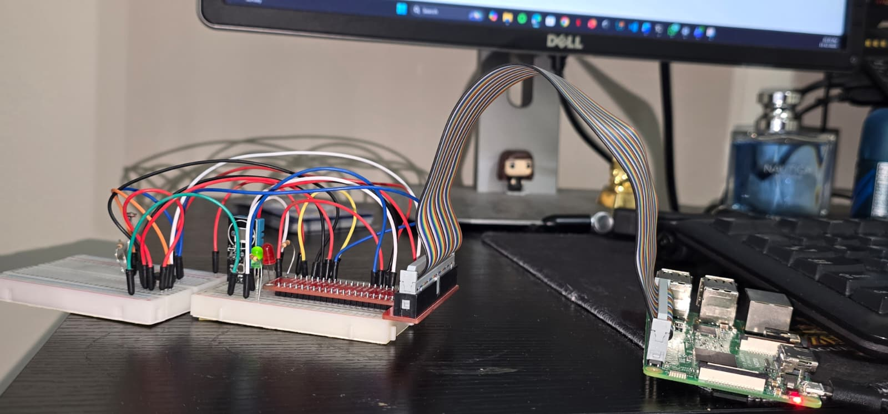
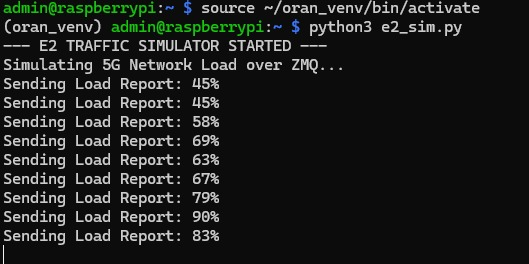
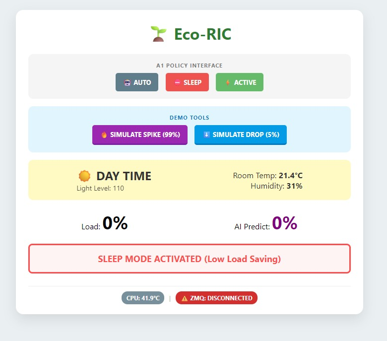
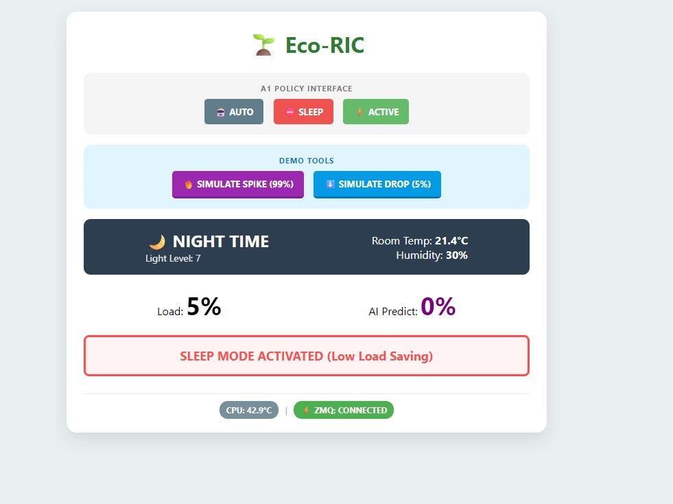
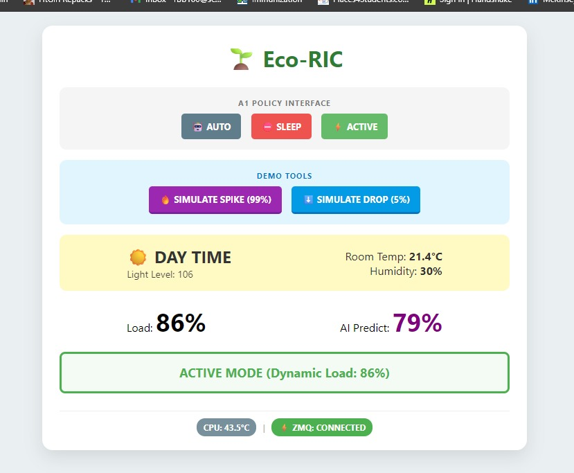
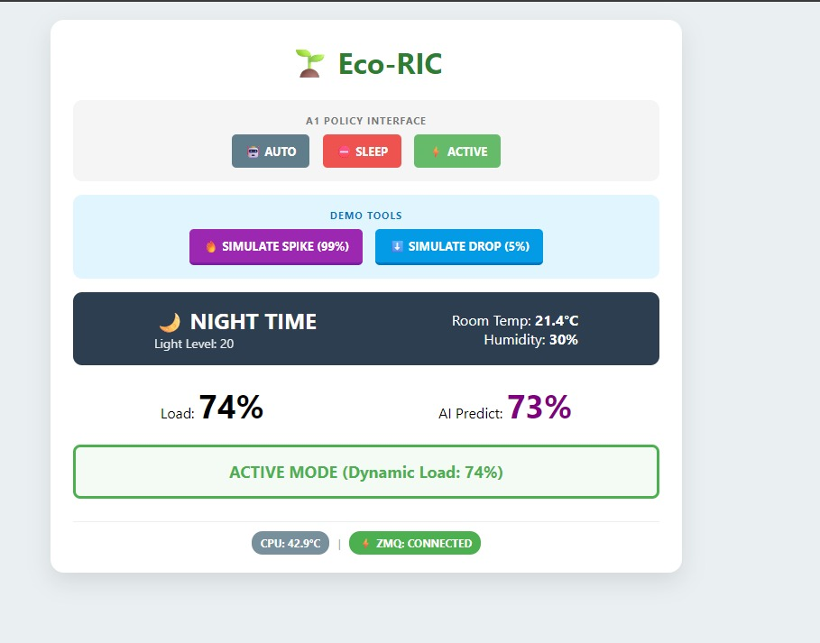
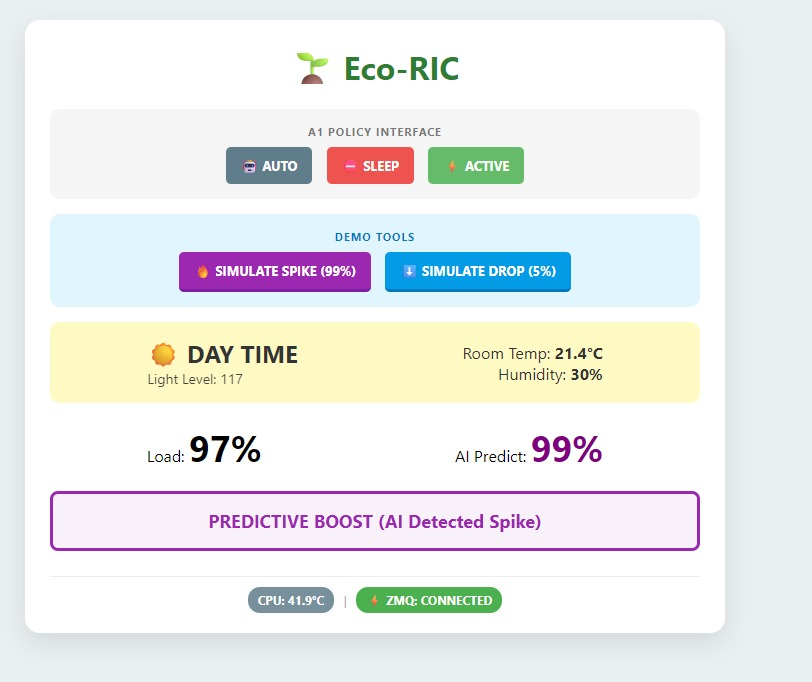

# Eco-RIC: O-RAN-Inspired Embedded Power Controller

A Raspberry Pi 4 prototype that demonstrates autonomous, energy-aware control of a simulated 5G Radio Unit, inspired by the O-RAN Near-Real-Time RIC architecture.

---

## Overview

The system dynamically adjusts Radio Unit power states in real time based on network telemetry received over a ZeroMQ pub/sub channel — mirroring how an O-RAN xApp would consume E2 interface metrics and apply an A1 policy.

A lightweight linear regression model predicts traffic surges before they occur, switching the RU to full power proactively rather than reactively.

---

## Architecture

```
┌──────────────────────────────────────────────────────┐
│              PC / Second Terminal                    │
│   e2_sim.py  →  ZMQ PUB  tcp://localhost:5555       │
└───────────────────────┬──────────────────────────────┘
                        │ ZeroMQ SUB
┌───────────────────────▼──────────────────────────────┐
│              Raspberry Pi 4  (Near-RT RIC)           │
│                                                      │
│   ric_controller.py                                  │
│   ┌─────────────┐   ┌──────────────────────────────┐ │
│   │ TrafficAI   │   │  Flask Dashboard :5000       │ │
│   │ (lin. reg.) │   │  /set_mode  /trigger_spike   │ │
│   └──────┬──────┘   └──────────────────────────────┘ │
│          │ policy decision                            │
│   ┌──────▼──────────────────┐                        │
│   │  GPIO / PWM             │                        │
│   │  Green LED (PWM)  → Active / Boost               │
│   │  Red LED          → Sleep                        │
│   └─────────────────────────┘                        │
└──────────────────────────────────────────────────────┘
```

---

## Hardware

| Component | Role |
|---|---|
| Raspberry Pi 4 Model B | Near-RT RIC controller |
| ADC0832 | Reads LDR via bit-banged SPI |
| LDR | Light sensor (day/night context) |
| DHT11 | Ambient temperature & humidity |
| Green LED (GPIO 27) | Active mode — PWM brightness scales with load |
| Red LED (GPIO 17) | Sleep mode indicator |

**GPIO Pin Mapping**

| Signal | BCM Pin |
|---|---|
| ADC CS | 5 |
| ADC CLK | 6 |
| ADC DI | 13 |
| ADC DO | 19 |
| Red LED | 17 |
| Green LED | 27 |
| DHT11 | 4 |

---

## Power Control Logic

| Condition | Mode | LED State |
|---|---|---|
| `load < 30%` | Sleep (low-power) | Red ON, Green OFF |
| `predicted_load > 85%` | Predictive Boost | Green 100% PWM |
| `30% ≤ load ≤ 85%` | Active (dynamic) | Green PWM = load% |

The `TrafficPredictorAI` class maintains a 10-sample rolling history and extrapolates the next load value using linear regression. This prevents the controller from reacting only after a spike has already arrived.

---

## Files

| File | Description |
|---|---|
| `src/ric_controller.py` | Main controller: ZMQ listener, GPIO control, Flask dashboard |
| `scripts/e2_sim.py` | Traffic simulator: publishes random-walk load over ZMQ |

---

## Quick Start

### 1. Install dependencies (on the Pi)

```bash
pip install -r requirements.txt
```

### 2. Start the traffic simulator (PC or second terminal)

```bash
python3 scripts/e2_sim.py
```

### 3. Start the RIC controller (on the Pi)

```bash
python3 src/ric_controller.py
```

### 4. Open the dashboard

Navigate to `http://<pi-ip>:5000` in your browser.

---

## Dashboard

The Flask dashboard auto-refreshes every 2 seconds and shows:

- Current network load and AI-predicted next load
- Active control mode and state (Sleep / Active / Predictive Boost)
- Ambient sensor readings (light level, temperature, humidity)
- CPU temperature and ZMQ connection status

**Manual controls:**
- `AUTO / SLEEP / ACTIVE` — A1 policy interface override
- `SIMULATE SPIKE (99%)` / `SIMULATE DROP (5%)` — 5-second demo injections

---

## Engineering Challenges

| Problem | Solution |
|---|---|
| ADC bit-banging misalignment | Fixed CLK/DI timing sequence for reliable SPI reads |
| ZMQ port reuse on restart | Added proper socket teardown before rebind |
| DHT11 timing instability | Wrapped reads in try/except with `None` fallback |

---

## Screenshots

### Hardware Setup


### ZMQ Traffic Simulator


### Sleep Mode



### Active Mode



### Predictive Boost


---

## Key Learnings

- Embedded Linux system integration on Raspberry Pi
- GPIO, PWM, and bit-banged SPI peripheral interfacing
- Distributed messaging with ZeroMQ pub/sub
- Translating O-RAN architecture concepts (E2 interface, A1 policy, xApp) into a hardware prototype
- Debugging timing-sensitive hardware alongside networked software

---

> **Scope note:** This is a functional prototype demonstrating architecture, control logic, and validation methodology — not a production O-RAN deployment.
